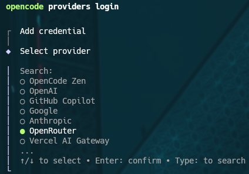
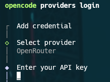

# CLI Reference

OpenCode CLI is built with yargs.

## Subcommands

| Command                                                              | Alias       | Description                                                    |
| -------------------------------------------------------------------- | ----------- | -------------------------------------------------------------- |
| [`opencode [project]`](#opencode-project)                            |             | Start TUI (default command)                                    |
| [`opencode run [message..]`](#opencode-run-message)                  |             | Run with a message                                             |
| [`opencode attach <url>`](#opencode-attach-url)                      |             | Attach to a running opencode server                            |
| [`opencode serve`](#opencode-serve)                                  |             | Start a headless opencode server                               |
| [`opencode web`](#opencode-web)                                      |             | Start server and open web interface                            |
| [`opencode providers`](#opencode-providers)                          | `auth`      | Manage AI providers and credentials                            |
| [`opencode models [provider]`](#opencode-models-provider)            |             | List all available models                                      |
| [`opencode agent`](#opencode-agent)                                  |             | Manage agents                                                  |
| [`opencode session`](#opencode-session)                              |             | Manage sessions                                                |
| [`opencode mcp`](#opencode-mcp)                                      |             | Manage MCP servers                                             |
| [`opencode plugin <module>`](#opencode-plugin-module)                | `plug`      | Install plugin and update config                               |
| [`opencode github`](#opencode-github)                                |             | Manage GitHub agent                                            |
| [`opencode pr <number>`](#opencode-pr-number)                        |             | Fetch/checkout a GitHub PR branch, then run opencode           |
| [`opencode completion`](#opencode-completion)                        |             | Generate shell completion script                               |
| [`opencode acp`](#opencode-acp)                                      |             | Start ACP (Agent Client Protocol) server                       |
| [`opencode debug`](#opencode-debug)                                  |             | Debugging and troubleshooting tools                            |
| [`opencode stats`](#opencode-stats)                                  |             | Show token usage and cost statistics                           |
| [`opencode export [sessionID]`](#opencode-export-sessionid)          |             | Export session data as JSON                                    |
| [`opencode import <file>`](#opencode-import-file)                    |             | Import session data from JSON file or URL                      |
| [`opencode db`](#opencode-db)                                        |             | Database tools                                                 |
| [`opencode upgrade [target]`](#opencode-upgrade-target)              |             | Upgrade to latest or a specific version                        |
| [`opencode uninstall`](#opencode-uninstall)                          |             | Uninstall opencode and remove all related files                |

Some subcommands accept additional flags. See the sections below for details.

---

### `opencode [project]`

Starts the interactive TUI. Without an argument, starts in the current directory.

```bash
# Start in the current directory
$ opencode

# Start in a specific project
$ opencode /path/to/project
```

---

### `opencode run [message..]`

Runs OpenCode with a single message without opening the TUI. In non-interactive mode, permission requests are automatically rejected (unless `--dangerously-skip-permissions` is set). Stdin is read automatically if it is not a TTY.

| Flag                             | Short | Type                  | Description                                                              | Default       |
| -------------------------------- | ----- | --------------------- | ------------------------------------------------------------------------ | ------------- |
| `[message..]`                    |       | string[]              | Message to send (positional argument)                                    |               |
| `--command`                      |       | string                | Command to run (message is used as its arguments)                        |               |
| `--continue`                     | `-c`  | boolean               | Continue the last session                                                |               |
| `--session`                      | `-s`  | string                | Session ID to continue                                                   |               |
| `--fork`                         |       | boolean               | Fork session before continuing (requires `--continue` or `--session`)   |               |
| `--share`                        |       | boolean               | Share the session                                                        |               |
| `--model`                        | `-m`  | string                | Model to use (`provider/model` format)                                   |               |
| `--agent`                        |       | string                | Agent to use (must be a primary agent, not a subagent)                   |               |
| `--format`                       |       | `default` \| `json`   | Output format                                                            | `default`     |
| `--file`                         | `-f`  | string[]              | File(s) to attach to the message                                         |               |
| `--title`                        |       | string                | Session title (truncated to 50 chars if empty)                           |               |
| `--attach`                       |       | string                | Connect to a running server (e.g. `http://localhost:4096`)               |               |
| `--password`                     | `-p`  | string                | Basic Auth password (defaults to `OPENCODE_SERVER_PASSWORD`)             |               |
| `--dir`                          |       | string                | Working directory (path on remote server if `--attach`)                  |               |
| `--port`                         |       | number                | Local server port (random if not specified)                              |               |
| `--variant`                      |       | string                | Model variant (reasoning effort: `high`, `max`, `minimal`)               |               |
| `--thinking`                     |       | boolean               | Show thinking blocks                                                     | `false`       |
| `--dangerously-skip-permissions` |       | boolean               | Auto-approve permissions not explicitly denied (**dangerous**)           | `false`       |

```bash
# Send a simple message
$ opencode run "Explain this file"

# Continue the last session
$ opencode run -c "What about the tests?"

# Use a specific model
$ opencode run -m "anthropic/claude-opus-4-5" "Fix the bug"

# Attach a file to the message
$ opencode run -f ./src/main.ts "Review this file"

# JSON output (raw events)
$ opencode run --format json "List all functions"

# Connect to a remote server
$ opencode run --attach http://localhost:4096 --dir /project "What changed?"

# Fork the current session before continuing
$ opencode run --fork -c "Try another approach"

# Pass text via stdin
$ echo "Fix this" | opencode run

# Auto-approve permissions (non-interactive pipeline)
$ opencode run --dangerously-skip-permissions "Refactor all files"
```

---

### `opencode attach <url>`

Connects to an already-running headless OpenCode server and opens the TUI on top of it.

```bash
# Attach to the default local server
$ opencode attach http://localhost:4096

# Attach to a remote server
$ opencode attach http://remote-host:4096
```

---

### `opencode serve`

Starts OpenCode in headless server mode (no UI). Displays a warning if `OPENCODE_SERVER_PASSWORD` is not set.

| Flag            | Type     | Description                                              | Default          |
| --------------- | -------- | -------------------------------------------------------- | ---------------- |
| `--port`        | number   | Listening port (0 = random port)                         | `0`              |
| `--hostname`    | string   | Listening address                                        | `127.0.0.1`      |
| `--mdns`        | boolean  | Enable mDNS service discovery (forces hostname to `0.0.0.0`) | `false`      |
| `--mdns-domain` | string   | Custom mDNS domain                                       | `opencode.local` |
| `--cors`        | string[] | Additional domains allowed for CORS                      | `[]`             |

```bash
# Start the server on a random port
$ opencode serve
opencode server listening on http://127.0.0.1:52341

# Start on a fixed port accessible from the network
$ opencode serve --port 4096 --hostname 0.0.0.0
opencode server listening on http://0.0.0.0:4096

# With mDNS discovery
$ opencode serve --mdns --mdns-domain myserver.local
opencode server listening on http://0.0.0.0:52341
```

---

### `opencode web`

Starts the server and automatically opens the web interface in the browser. Displays local and network URLs. Displays a warning if `OPENCODE_SERVER_PASSWORD` is not set.

Accepts the same network flags as [`opencode serve`](#opencode-serve).

```bash
# Start the web interface (localhost)
$ opencode web

# Accessible from the local network
$ opencode web --hostname 0.0.0.0 --port 4096

# With mDNS discovery
$ opencode web --mdns
```

---

### `opencode providers`

Manages AI providers and their credentials. **Alias: `opencode auth`** (identical, same code).

Credentials are stored in `~/.local/share/opencode/auth.json`.

#### `opencode providers list`

Alias: `ls`. Lists stored credentials and detected active environment variables.

```
$ opencode providers list
┌  Credentials ~/.local/share/opencode/auth.json
│
●  OpenRouter api
│
●  Google api
│
●  zai-coding api
│
└  3 credentials
```

#### `opencode providers login`

Authenticates with a provider. Without arguments, shows an interactive provider selection menu. Supports OAuth (auto or code) and API key.

| Argument / Flag | Short | Type   | Description                                              |
| --------------- | ----- | ------ | -------------------------------------------------------- |
| `[url]`         |       | string | URL of an opencode provider (wellknown auth)             |
| `--provider`    | `-p`  | string | Provider ID or name (skips interactive selection)        |
| `--method`      | `-m`  | string | Login method (skips method selection)                    |

```bash
# Interactive provider selection
$ opencode providers login
$ opencode auth login

# Directly target a provider
$ opencode auth login --provider anthropic

# With a specific method
$ opencode auth login --provider openai --method "API Key"

# Custom provider via wellknown URL
$ opencode auth login https://my-opencode-server.com
```





#### `opencode providers logout`

Removes a stored credential (interactive selection).

```bash
$ opencode providers logout
$ opencode auth logout
```

---

### `opencode models [provider]`

Lists all available models in `provider/model` format, one per line. OpenCode models appear first, then sorted by provider.

| Argument / Flag | Type    | Description                                        |
| --------------- | ------- | -------------------------------------------------- |
| `[provider]`    | string  | Filter by provider (e.g. `anthropic`)              |
| `--verbose`     | boolean | Show metadata (costs, limits, etc.) as JSON        |
| `--refresh`     | boolean | Force cache refresh from `models.dev`              |

```
$ opencode models opencode
opencode/big-pickle
opencode/gpt-5-nano
opencode/minimax-m2.5-free
opencode/nemotron-3-super-free
```

```bash
# List all providers
$ opencode models

# With metadata (costs, limits, etc.)
$ opencode models --verbose

# Force cache refresh
$ opencode models --refresh
```

---

### `opencode agent`

Manages available agents.

#### `opencode agent list`

Lists all agents with their mode (`all`, `primary`, `subagent`) and permissions.

```bash
$ opencode agent list
```

#### `opencode agent create`

Creates a new agent (interactive, or non-interactive if all flags are provided). The agent is generated by the LLM from the description.

| Flag            | Short | Type                             | Description                                          |
| --------------- | ----- | -------------------------------- | ---------------------------------------------------- |
| `--path`        |       | string                           | Directory to generate the agent file in              |
| `--description` |       | string                           | What the agent should do                             |
| `--mode`        |       | `all` \| `primary` \| `subagent` | Agent mode                                           |
| `--tools`       |       | string                           | Comma-separated list of tools to enable (empty = all)|
| `--model`       | `-m`  | string                           | Model to use for generation                          |

Available tools: `bash`, `read`, `write`, `edit`, `glob`, `grep`, `webfetch`, `task`, `todowrite`.

```bash
# Interactive creation
$ opencode agent create

# Fully non-interactive
$ opencode agent create \
  --description "Analyzes code for security vulnerabilities" \
  --mode primary \
  --tools "bash,read,grep" \
  --path .opencode/agent
```

---

### `opencode session`

Manages saved sessions.

#### `opencode session list`

Lists root sessions (non-forked), with automatic pagination via `less` when in a TTY.

| Flag          | Short | Type              | Description                                | Default |
| ------------- | ----- | ----------------- | ------------------------------------------ | ------- |
| `--max-count` | `-n`  | number            | Limit to the N most recent sessions        |         |
| `--format`    |       | `table` \| `json` | Output format                              | `table` |

```
$ opencode session list -n 5
Session ID                      Title                                    Updated
────────────────────────────────────────────────────────────────────────────────
ses_26aa2e465ffeveeUkoMXcj1bdY  New session - 2026-04-16T08:16:40.346Z  11:19 AM
ses_2d4722314ffeToKD6sK0NyUraE  New session - 2026-03-26T19:10:10.668Z  8:10 PM · 3/26/2026
ses_2d47926cfffeiyAyyToArrMxI6  New session - 2026-03-26T19:02:30.960Z  8:08 PM · 3/26/2026
ses_2d479f851ffeAYAH9Xereioh4q  New session - 2026-03-26T19:01:37.327Z  8:01 PM · 3/26/2026
ses_2d5afa390ffeCnJ84JiDz8xGjw  New session - 2026-03-26T13:23:22.668Z  2:24 PM · 3/26/2026
```

```bash
# JSON format
$ opencode session list --format json
```

#### `opencode session delete <sessionID>`

Deletes a session by its ID.

```bash
$ opencode session delete ses_26aa2e465ffeveeUkoMXcj1bdY
```

---

### `opencode mcp`

Manages MCP (Model Context Protocol) servers.

#### `opencode mcp list`

Alias: `ls`. Lists configured MCP servers with their connection status.

```bash
$ opencode mcp list
$ opencode mcp ls
```

#### `opencode mcp add`

Adds an MCP server interactively (type `local` or `remote`, project or global scope).

```bash
$ opencode mcp add
```

#### `opencode mcp auth [name]`

Authenticates with an MCP server via OAuth. Without arguments, shows a selection menu.

```bash
# Interactive selection
$ opencode mcp auth

# Directly target a server
$ opencode mcp auth my-server

# List OAuth statuses
$ opencode mcp auth list
```

#### `opencode mcp logout [name]`

Removes OAuth credentials for an MCP server.

```bash
$ opencode mcp logout
$ opencode mcp logout my-server
```

#### `opencode mcp debug <name>`

Diagnoses an MCP server's OAuth connection (HTTP test, token status, OAuth discovery).

```bash
$ opencode mcp debug my-server
```

---

### `opencode plugin <module>`

Installs an npm plugin and updates the configuration. **Alias: `opencode plug`**.

| Argument / Flag | Short | Type    | Description                                        | Default |
| --------------- | ----- | ------- | -------------------------------------------------- | ------- |
| `<module>`      |       | string  | npm module name (with optional version/git suffix) |         |
| `--global`      | `-g`  | boolean | Install into the global config                     | `false` |
| `--force`       | `-f`  | boolean | Replace existing version                           | `false` |

```bash
# Install a plugin from npm
$ opencode plugin my-plugin

# Install from GitHub
$ opencode plugin superpowers@git+https://github.com/obra/superpowers.git

# Alias plug, global install
$ opencode plug my-plugin --global

# Force reinstall
$ opencode plugin my-plugin --force
```

---

### `opencode github`

Manages the GitHub integration (GitHub Actions agent).

#### `opencode github install`

Sets up the GitHub agent: installs the GitHub App, generates the workflow file `.github/workflows/opencode.yml`.

```bash
$ opencode github install
```

#### `opencode github run`

Runs the GitHub agent (used by the GitHub Action). Supports mock mode for local testing.

| Flag      | Type   | Description                                           |
| --------- | ------ | ----------------------------------------------------- |
| `--event` | string | Mock GitHub event (JSON Context) for local testing    |
| `--token` | string | Personal GitHub token for local testing               |

```bash
# Normal execution (in GitHub Actions)
$ opencode github run

# Local test with mock
$ opencode github run --token github_pat_xxxx --event '{"eventName":"issue_comment",...}'
```

---

### `opencode pr <number>`

Fetches and checks out the branch of a GitHub Pull Request (via the `gh` CLI), then launches OpenCode. Handles fork PRs automatically. If the PR description contains an OpenCode session link, it is imported automatically.

Requires the `gh` CLI to be installed and authenticated.

```
$ opencode pr 42
Fetching and checking out PR #42...
Successfully checked out PR #42 as branch 'pr/42'

Starting opencode...
```

---

### `opencode completion`

Generates a shell completion script (bash/zsh) via yargs.

```bash
# Enable completion in the current shell
$ eval "$(opencode completion)"

# Save for bash
$ opencode completion >> ~/.bashrc

# Save for zsh
$ opencode completion >> ~/.zshrc
```

---

### `opencode acp`

Starts an ACP (Agent Client Protocol) server for integration with third-party tools via stdin/stdout.

Accepts the same network flags as [`opencode serve`](#opencode-serve), plus:

| Flag    | Type   | Description       | Default             |
| ------- | ------ | ----------------- | ------------------- |
| `--cwd` | string | Working directory | current directory   |

```bash
# Start the ACP server
$ opencode acp

# With a specific working directory
$ opencode acp --cwd /path/to/project
```

---

### `opencode debug`

Debugging and diagnostic tools.

| Subcommand | Description                                               |
| ---------- | --------------------------------------------------------- |
| `config`   | Show the resolved configuration                           |
| `lsp`      | Diagnose the LSP server                                   |
| `ripgrep`  | Diagnose ripgrep                                          |
| `file`     | Diagnose file handling                                    |
| `scrap`    | Diagnose scraping                                         |
| `skill`    | Diagnose a skill                                          |
| `snapshot` | Diagnose snapshots                                        |
| `agent`    | Diagnose an agent                                         |
| `paths`    | Show global paths (data, config, cache, state)            |
| `wait`     | Wait indefinitely (for process debugging)                 |

```
$ opencode debug paths
home       /home/glemeur
data       /home/glemeur/.local/share/opencode
bin        /home/glemeur/.cache/opencode/bin
log        /home/glemeur/.local/share/opencode/log
cache      /home/glemeur/.cache/opencode
config     /home/glemeur/.config/opencode
state      /home/glemeur/.local/state/opencode
```

```bash
# Show resolved configuration (JSON)
$ opencode debug config

# With detailed logs
$ opencode debug config --log-level DEBUG
```

---

### `opencode stats`

Shows token usage and cost statistics (sessions, messages, total cost, cost/day, tokens per session, tool usage).

| Flag        | Type   | Description                                                              |
| ----------- | ------ | ------------------------------------------------------------------------ |
| `--days`    | number | Statistics for the last N days (0 = today, default: all time)           |
| `--tools`   | number | Number of tools to display (default: all)                                |
| `--models`  |        | Show per-model stats (number = top N, flag alone = all)                  |
| `--project` | string | Filter by project (empty = current project, absent = all projects)       |

```
$ opencode stats
┌────────────────────────────────────────────────────────┐
│                       OVERVIEW                         │
├────────────────────────────────────────────────────────┤
│Sessions                                            103 │
│Messages                                          1,688 │
│Days                                                 28 │
└────────────────────────────────────────────────────────┘

┌────────────────────────────────────────────────────────┐
│                    COST & TOKENS                       │
├────────────────────────────────────────────────────────┤
│Total Cost                                        $0.01 │
│Avg Cost/Day                                      $0.00 │
│Avg Tokens/Session                               593.7K │
│Median Tokens/Session                             44.8K │
│Input                                             20.7M │
│Output                                           261.0K │
│Cache Read                                        39.6M │
│Cache Write                                      561.6K │
└────────────────────────────────────────────────────────┘

┌────────────────────────────────────────────────────────┐
│                      TOOL USAGE                        │
├────────────────────────────────────────────────────────┤
│ bash               ████████████████████ 376 (37.3%)    │
│ read               ██████████           190 (18.8%)    │
│ edit               ██████               122 (12.1%)    │
│ webfetch           █████                107 (10.6%)    │
│ glob               ██                    38 ( 3.8%)    │
│ write              █                     34 ( 3.4%)    │
│ websearch          █                     31 ( 3.1%)    │
│ grep               █                     20 ( 2.0%)    │
│ todowrite          █                     17 ( 1.7%)    │
└────────────────────────────────────────────────────────┘
```

```bash
# Stats for the last 7 days
$ opencode stats --days 7

# With per-model stats (top 5)
$ opencode stats --models 5

# Current project only
$ opencode stats --project ""
```

---

### `opencode export [sessionID]`

Exports session data as JSON to stdout. Without a sessionID, shows an interactive selection menu. Selection prompts are written to stderr to allow stdout redirection.

| Argument / Flag | Type    | Description                                                  |
| --------------- | ------- | ------------------------------------------------------------ |
| `[sessionID]`   | string  | Session ID to export (default: interactive selection)        |
| `--sanitize`    | boolean | Redact sensitive data (transcripts, paths)                   |

```bash
# Export a specific session
$ opencode export ses_26aa2e465ffeveeUkoMXcj1bdY > session.json

# Export without sensitive data (for public sharing)
$ opencode export ses_26aa2e465ffeveeUkoMXcj1bdY --sanitize > session-public.json

# Interactive selection (menu on stderr, JSON on stdout)
$ opencode export > session.json
```

---

### `opencode import <file>`

Imports session data from a local JSON file or a share URL. The imported session is associated with the current project.

```
$ opencode import ./session.json
Imported session: ses_26aa2e465ffeveeUkoMXcj1bdY

$ opencode import https://opencode.ai/share/abc123
Imported session: ses_26aa2e465ffeveeUkoMXcj1bdY
```

---

### `opencode db`

SQLite local database management tools.

#### `opencode db [query]`

Opens an interactive SQLite shell (via `sqlite3`), or executes a SQL query directly.

| Argument / Flag | Type            | Description                         | Default |
| --------------- | --------------- | ----------------------------------- | ------- |
| `[query]`       | string          | SQL query to execute                |         |
| `--format`      | `json` \| `tsv` | Output format for query results     | `tsv`   |

```
$ opencode db "SELECT id, title FROM sessions LIMIT 3"
id                              title
ses_26aa2e465ffeveeUkoMXcj1bdY  New session - 2026-04-16T08:16:40.346Z
ses_2d4722314ffeToKD6sK0NyUraE  New session - 2026-03-26T19:10:10.668Z
ses_2d47926cfffeiyAyyToArrMxI6  New session - 2026-03-26T19:02:30.960Z

$ opencode db "SELECT id, title FROM sessions LIMIT 2" --format json
[
  {
    "id": "ses_26aa2e465ffeveeUkoMXcj1bdY",
    "title": "New session - 2026-04-16T08:16:40.346Z"
  },
  {
    "id": "ses_2d4722314ffeToKD6sK0NyUraE",
    "title": "New session - 2026-03-26T19:10:10.668Z"
  }
]
```

#### `opencode db path`

Displays the database path.

```
$ opencode db path
/home/glemeur/.local/share/opencode/opencode.db
```

#### `opencode db migrate`

Migrates legacy JSON data to SQLite (with a progress bar).

```bash
$ opencode db migrate
```

---

### `opencode upgrade [target]`

Upgrades OpenCode. Automatically detects the installation method (curl, npm, pnpm, bun, brew, choco, scoop).

| Argument / Flag | Short | Type   | Description                                                                 |
| --------------- | ----- | ------ | --------------------------------------------------------------------------- |
| `[target]`      |       | string | Target version (e.g. `0.1.48` or `v0.1.48`, default: latest)               |
| `--method`      | `-m`  | string | Force a method (`curl`, `npm`, `pnpm`, `bun`, `brew`, `choco`, `scoop`)    |

```bash
# Upgrade to the latest version
$ opencode upgrade

# Upgrade to a specific version
$ opencode upgrade 1.0.180

# Force npm method
$ opencode upgrade --method npm
```

---

### `opencode uninstall`

Uninstalls OpenCode and removes all associated files (data, cache, config, state, binary). Asks for confirmation before acting.

| Flag            | Short | Type    | Description                                       | Default |
| --------------- | ----- | ------- | ------------------------------------------------- | ------- |
| `--keep-config` | `-c`  | boolean | Keep configuration files                          | `false` |
| `--keep-data`   | `-d`  | boolean | Keep sessions and snapshots                       | `false` |
| `--dry-run`     |       | boolean | Show what would be deleted without acting         | `false` |
| `--force`       | `-f`  | boolean | Skip interactive confirmations                    | `false` |

```bash
# Show what would be deleted without acting
$ opencode uninstall --dry-run

# Keep configuration
$ opencode uninstall --keep-config

# Uninstall without confirmation
$ opencode uninstall --force
```

---

## Global Flags

| Flag           | Short | Description                          |
| -------------- | ----- | ------------------------------------ |
| `--help`       | `-h`  | Show help                            |
| `--version`    | `-v`  | Show version number                  |
| `--print-logs` |       | Print logs to stderr                 |
| `--log-level`  |       | Log level (DEBUG, INFO, WARN, ERROR) |

## Run Flags

| Flag                             | Short | Description                                                              |
| -------------------------------- | ----- | ------------------------------------------------------------------------ |
| `[message..]`                    |       | Message to send (positional argument)                                    |
| `--command`                      |       | Command to run, use message for args                                     |
| `--continue`                     | `-c`  | Continue the last session                                                |
| `--session`                      | `-s`  | Session ID to continue                                                   |
| `--fork`                         |       | Fork session before continuing (requires --continue/--session)           |
| `--share`                        |       | Share the session                                                        |
| `--model`                        | `-m`  | Model to use (`provider/model` format)                                   |
| `--agent`                        |       | Agent to use                                                             |
| `--format`                       |       | Output format: `default` (formatted) or `json` (raw events)              |
| `--file`                         | `-f`  | File(s) to attach to message                                             |
| `--title`                        |       | Title for the session (uses truncated prompt if no value provided)       |
| `--attach`                       |       | Attach to a running server (e.g., `http://localhost:4096`)               |
| `--password`                     | `-p`  | Basic auth password (defaults to `OPENCODE_SERVER_PASSWORD`)             |
| `--dir`                          |       | Directory to run in (path on remote server if attaching)                 |
| `--port`                         |       | Port for the local server (defaults to random port if no value provided) |
| `--variant`                      |       | Model variant (provider-specific reasoning effort: high, max, minimal)   |
| `--thinking`                     |       | Show thinking blocks                                                     |
| `--dangerously-skip-permissions` |       | Auto-approve permissions that are not explicitly denied (dangerous!)     |
